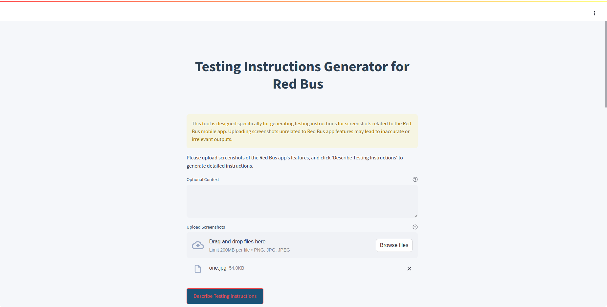
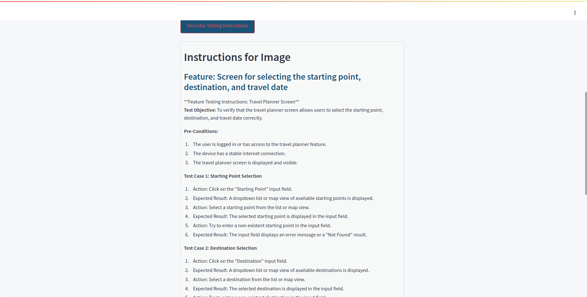
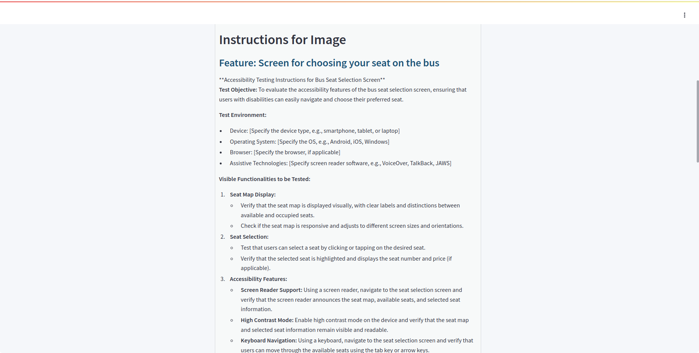

# **Red Bus Testing Instructions Generator**

## **Overview**

Welcome to the Red Bus Testing Instructions Generator! This tool leverages multimodal AI to generate detailed testing instructions for features of the Red Bus mobile app, based on uploaded screenshots. By combining the power of CLIP for image-text matching and llama-3.1-70b-versatile for text generation, this tool simplifies the process of creating comprehensive test cases.

I have tried with two python frameworks i.e.,
  - **streamlit**:- which has the capability for uploading multi-images
  2) **gradio**:- single-image uploader

## **Features**

- **Image-Based Feature Identification**: Upload screenshots of the Red Bus app, and the tool will automatically identify the relevant feature.
- **Detailed Testing Instructions**: Generate thorough and customized test cases including pre-conditions, testing steps, and expected results.
- **Multi-Shot Prompts**: Provides structured prompts for various features like bus selection, seat selection, and more.

## **Technology Stack**

- **Frontend**: Streamlit
- **Models Used**:
  - **CLIP**: Used for matching screenshots to predefined feature descriptions by analyzing image content.
  - **llama-3.1-70b-versatile**: Used for generating detailed and accurate testing instructions based on the identified feature.
  - **Haystack**: Utilized for natural language processing tasks to enhance the prompting strategy and optimize query handling.
  - **Groq**: Integrated for accelerated AI inference, improving the performance and speed of generating testing instructions.
- **Backend**: PyTorch, Transformers, OpenAIGenerator

## **Why CLIP and llama-3.1-70b-versatile ?**

- **CLIP**: Chosen for its robust ability to match images with relevant text descriptions, ensuring that the tool focuses on the correct feature for generating instructions.
- **llama-3.1-70b-versatile**: Selected for its high-quality text generation capabilities, producing precise and comprehensive testing instructions tailored to the identified feature.

## **Prompting Strategy**

The tool employs a specialized prompting strategy to ensure that the generated testing instructions are accurate and comprehensive. Here's how it works:

1. **Feature Matching**: When a screenshot is uploaded, it is processed using CLIP to determine which predefined feature description it matches most closely.
2. **Multi-Shot Prompt Integration**: The identified feature is then matched with a corresponding multi-shot prompt, which provides a structured template for the testing instructions.
3. **Contextual Prompting**: If optional context is provided by the user, it is integrated into the prompt to tailor the instructions further to the specific scenario.
4. **Instruction Generation**: The final prompt is sent to the llama-3.1-70b-versatile model, which generates detailed testing instructions based on the identified feature and any additional context provided.

## **Screenshots**

### **Screenshot 1: Source, Destination, and Date Selection**




### **Screenshot 2: Seat Selection with optional context**




## **Getting Started**

### **Prerequisites**

- Python 3.8 or higher
- Install the required Python packages using `pip`:
  1) pip install streamlit
  2) pip install haystack-ai
  3) pip install transformers torch
## **Installation**

### **Clone the repository:**

```bash
git clone https://github.com/cherrymekala/Myracle-AI-Engineer-Intern-Task.git
cd TASK
```

### **Set up your environment variables**

1. Create a `.env` file in the root directory.
2. Add your OpenAI API key:

    ```makefile
    GROQ_API_KEY=your_groq_api_key_here
    ```

### **Run the Streamlit app**:

```bash
streamlit run app.py
```


### **Usage:**

- **Upload Screenshots**: In the Streamlit interface, upload one or more screenshots of the Red Bus app features you want to generate testing instructions for.

- **Optional Context**: Provide any additional context that could help generate more accurate instructions.

- **Generate Instructions**: Click on the "Describe Testing Instructions" button, and the tool will display the generated test cases.

### **Demo Video:**

[Watch the implementation video](https://drive.google.com/file/d/1cvnWaGrBWY3txIaMLxDlMJhC1VWkapEJ/view?usp=sharing) to see the tool in action.


### **Contribution:**

Contributions are welcome! If you find a bug or have a feature request, feel free to open an issue or submit a pull request.
